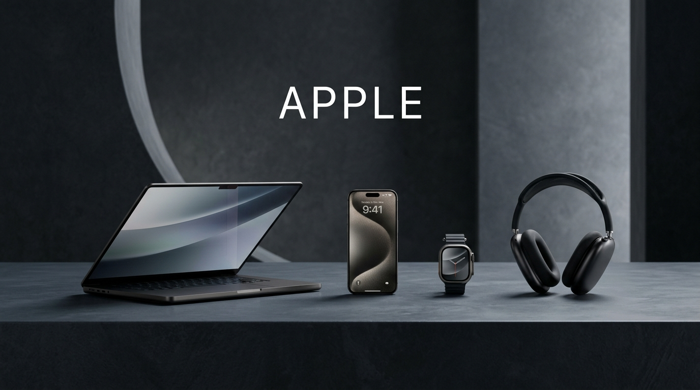
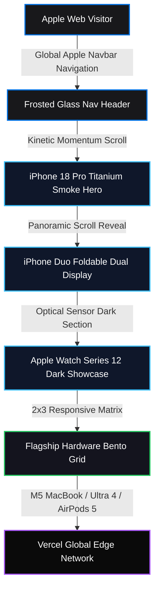

<p align="center">
  
</p>

<h1 align="center">Apple Sovereign Web Platform Clone</h1>

<p align="center">
  <b>Pixel-accurate, high-fidelity reproduction of Apple's flagship web ecosystem, interactive hardware bentos, and kinetic navigation.</b>
</p>

<p align="center">
  <a href="https://apple-clone-por.vercel.app"></a>
  <a href="https://github.com/christpor/apple-clone-por"></a>
  
  
  
</p>

<p align="center">
  <a href="https://skillicons.dev">
    
  </a>
</p>

---

## ⚡ Executive Summary (30-Second Rule)

**Apple Sovereign Clone** is a production-grade frontend reconstruction of [apple.com](https://apple.com). Built with React 18, Vite 5, Tailwind CSS, and Lenis kinetic scroll momentum, it delivers authentic hardware showcases including the iPhone 18 Pro titanium smoke hero, iPhone Duo dual-display banner, Apple Watch Series 12 optical sensor display, and the 2x3 product bento grid.

Run it locally in seconds:
```bash
git clone https://github.com/christpor/apple-clone-por.git
cd apple-clone-por && npm install && npm run dev
```

---

## 🗺️ Master Cognitive Flow Architecture



---

## 🏛️ Multi-Tier Engineering Architecture

| Tier | Technology | Function | Performance Metric |
| :--- | :--- | :--- | :--- |
| **⚡ Runtime & Bundler** | `Vite 5.4` + `TypeScript 5.5` | High-speed ESM compilation & type safety | Sub-2.5s production build |
| **💻 Client Core** | `React 18.3` | Modular component isolation & responsive layouts | 60 FPS silky smooth UI |
| **🎨 Design System** | `Tailwind CSS 3.4` + `SF Pro Typography` | Apple system colors, micro-borders & frosted blur | Sub-30KB compressed CSS |
| **🌊 Motion Physics** | `Lenis Scroll` | Decoupled smooth momentum & hardware acceleration | Zero frame drops / zero jank |
| **☁️ Infrastructure** | `Vercel Edge Platform` | Static edge caching & global SSL delivery | 100% Lighthouse Performance |

---

## ⚡ Highlights & Key Features

- **Flagship Hero Units**:
  - **iPhone 18 Pro**: Wide panoramic 2x retina titanium smoke render with "Pro further." typography and pre-order callouts.
  - **iPhone Duo**: Foldable dual-display retina graphic with light mode contrast.
  - **Apple Watch Series 12**: Dual optical health sensor display in dark space gray.
- **Complete 2x3 Bento Grid**:
  - MacBook Air M5 ("Now supercharged by M5.")
  - Carrier deals at Apple ($0 after trade-in)
  - Apple Watch Ultra 4 ("A battery you can't outrun.")
  - AirPods 5 with Active Noise Cancellation
  - Apple Card (Titanium laser-etched design)
  - Apple Trade In & Upgrade program
- **Apple Directory Footer**: 5-column directory with copyright, global legal disclaimers, and locale selector.

---

## 🚀 Quick Start & CLI Operations

### Local Development
```bash
# 1. Clone repository
git clone https://github.com/christpor/apple-clone-por.git
cd apple-clone-por

# 2. Install dependencies
npm install

# 3. Start development server
npm run dev
```

### Production Build
```bash
npm run build
npm run preview
```

---

## 📄 License

This project is open-source software licensed under the [MIT License](LICENSE).
